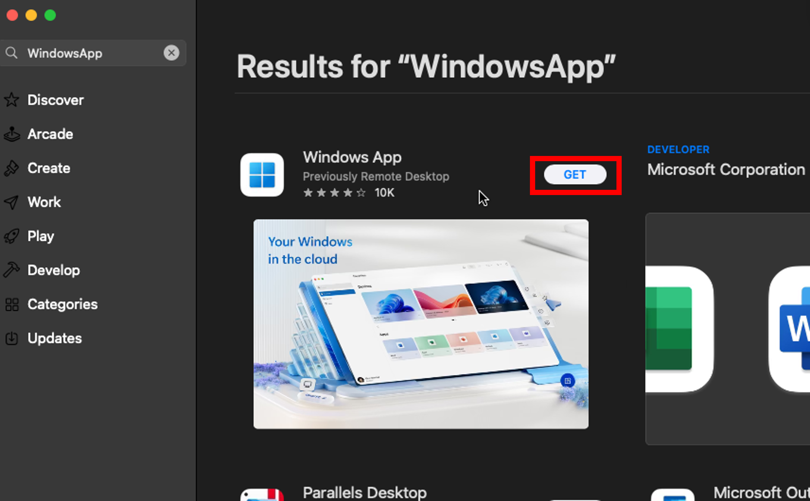
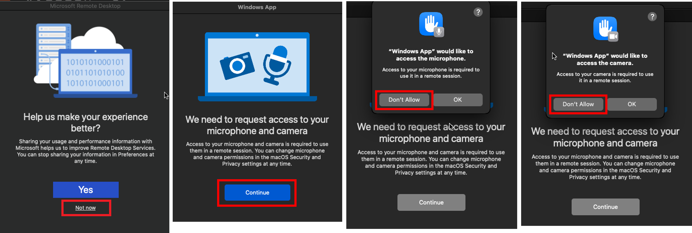
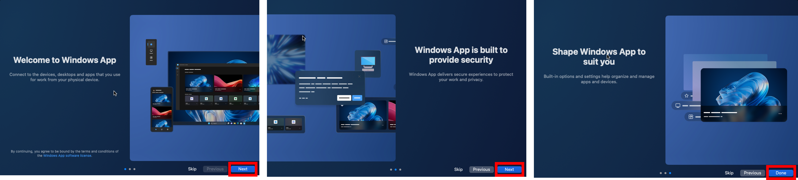
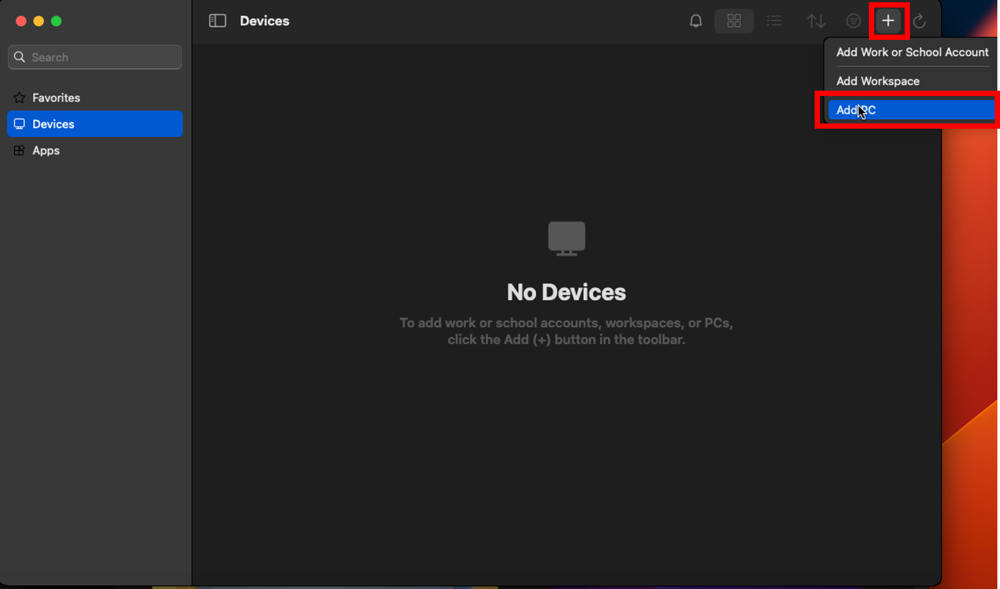
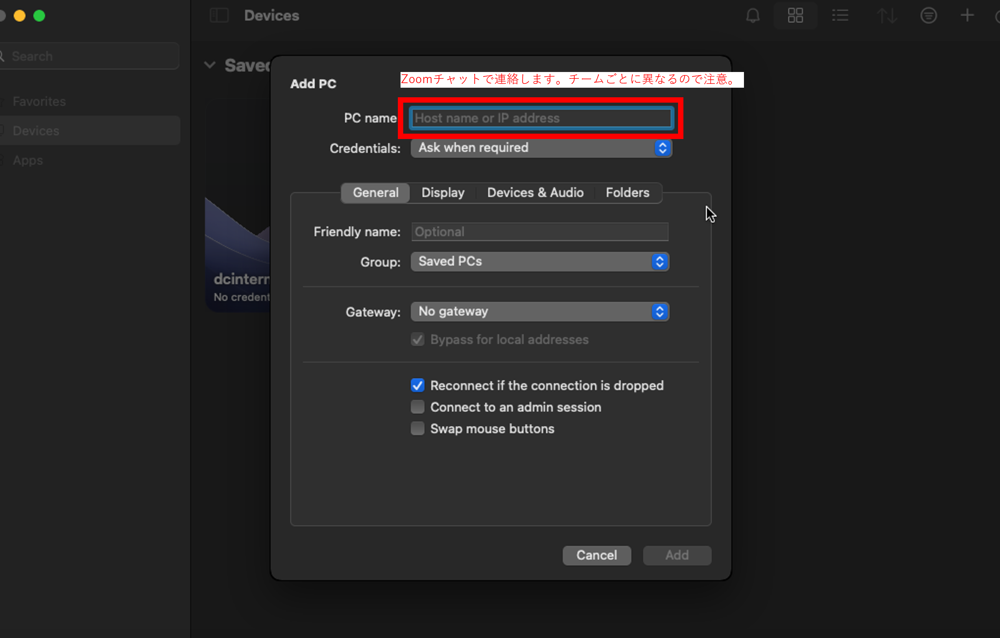
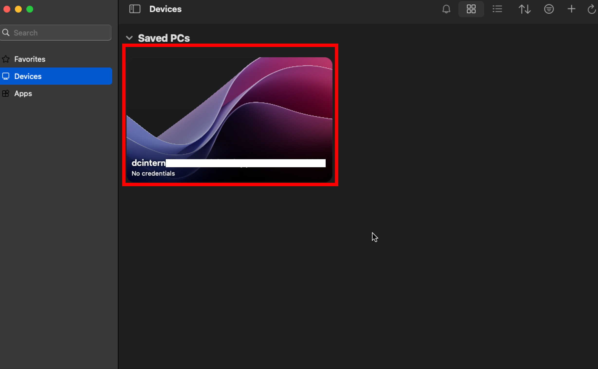
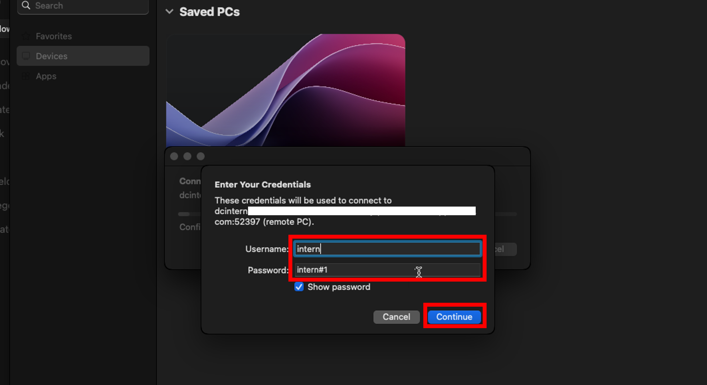
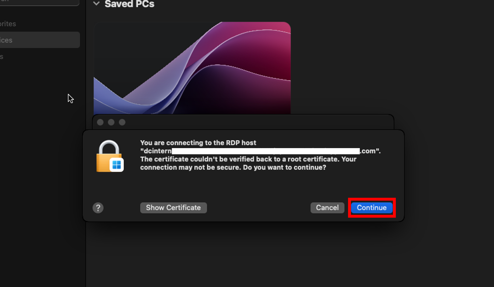
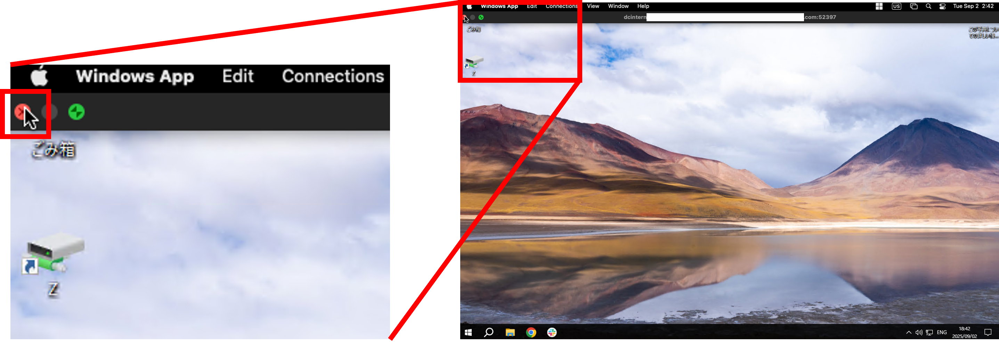

# 接続手順書

## 開発用PCへ接続する

Windowsの人

1. 画面を共有しながら進めましょう。  
    接続に詰まった場合に画面を見せながら相談できます。

1. スタートメニューを開き、「リモートデスクトップ接続」と検索して開いてください。  
  

1. チームごとに、決められたコンピュータに対して接続します。  
  「コンピューター」に以下アドレスを入力し、「接続」をクリックします。  
    |項目|入力|
    |-|-|
    |コンピューター|__※コンピューター名(=開発PC名)はZoomのチャットで連絡します。 チーム毎に異なるので注意__|

      
      

1. 以下ユーザー名とパスワードを入力してOKします。  
   もし自分のアカウント名がすでに入っている場合は、下のほうにある「その他」→「別のアカウントを使用する」を押してください。  
    |項目|入力|
    |-|-|
    |ユーザー名|intern|
    |パスワード|intern#1|  

      
      

2. これで開発用PCにログインできました。  
   接続の練習はここまでです。  
   リモートデスクトップを切断し、次の人に開発用PCに接続してもらいましょう。  
   全員接続できたら一区切りです。Slackに完了したことを書き込み、雑談して待ちましょう。

   

Macの人

1. 画面を共有しながら進めましょう。  
    接続に詰まった場合に画面を見せながら相談できます。

1. App Storeを開いて、「Windows App」で検索します。  
    出てきたアプリを「インストール」して、インストールが終わったら「開く」を押してください。  
  

1. 最初に聞かれる内容は「Not now」「Continue」「Don't Allow」「Don't Allow」を選択します。  
  

1. 次に、「Next」「Next」「Done」を選択して進めます。  
  

1. アプリが起動しました。ここから、チームごとに決められたコンピュータに接続します。  
  最初に、「Add PC」を押します。  
  

1. 出てきた画面の「PC name」に以下を入力し、「Add」をクリックします。
    |項目|入力|
    |-|-|
    |PC name|__※PC name(=開発PC名)はZoomのチャットで連絡します。 チーム毎に異なるので注意__|

    

1. 作成されたボタンをダブルクリックします。  
  

1. ユーザー名とパスワードに以下を入れて「Continue」を押します。
    |項目|入力|
    |-|-|
    |Username|intern|
    |Password|intern#1|

    

1. 以下のようなメッセージが出た場合、「Continue」を押します。  
  

1. これで開発用PCにログインできました。  
   接続の練習はここまでです。  
   リモートデスクトップを切断し、次の人に開発用PCに接続してもらいましょう。  
   全員接続できたら一区切りです。Slackに完了したことを書き込み、雑談して待ちましょう。

  

